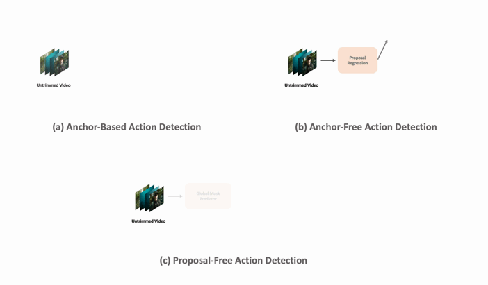
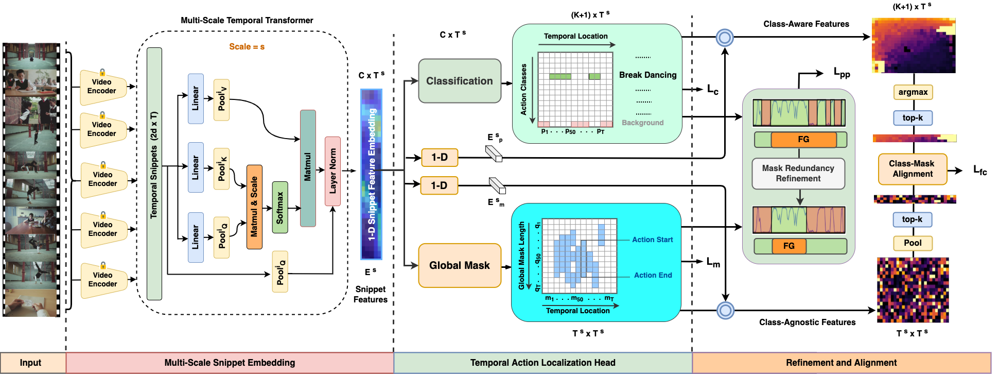
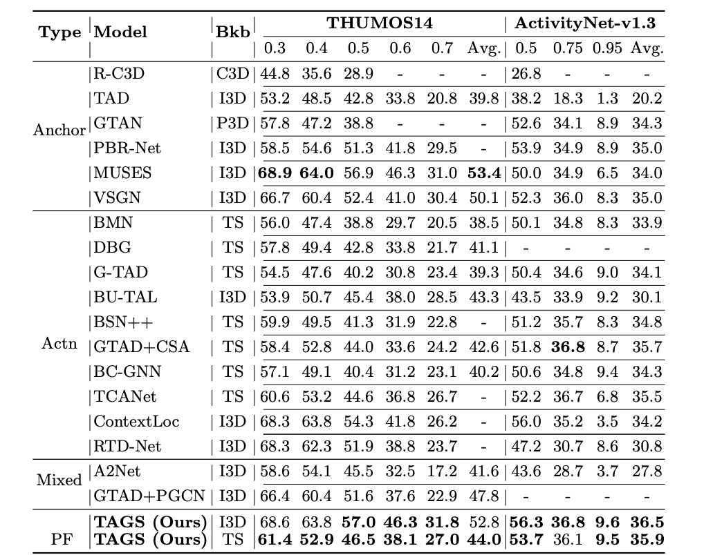

[](https://paperswithcode.com/sota/temporal-action-localization-on-activitynet?p=temporal-action-detection-with-global)
[](https://paperswithcode.com/sota/temporal-action-localization-on-thumos14?p=temporal-action-detection-with-global)
<div align="center">

<h1>Proposal-Free Temporal Action Detection with Global Segmentation Mask Learning</h1>

<div>
    <a href='https://sauradip.github.io/' target='_blank'>Sauradip Nag</a><sup>1,2,+</sup>&emsp;
    <a href='https://scholar.google.co.uk/citations?hl=en&user=ZbA-z1cAAAAJ&view_op=list_works&sortby=pubdate' target='_blank'>Xiatian Zhu</a><sup>1,3</sup>&emsp;
    <a href='https://scholar.google.co.uk/citations?user=irZFP_AAAAAJ&hl=en' target='_blank'>Yi-Zhe Song</a><sup>1,2</sup>&emsp;
    <a href='https://scholar.google.co.uk/citations?hl=en&user=MeS5d4gAAAAJ&view_op=list_works&sortby=pubdate' target='_blank'>Tao Xiang</a><sup>1,2</sup>&emsp;
</div>
<div>
    <sup>1</sup>CVSSP, University of Surrey, UK&emsp;
    <sup>2</sup>iFlyTek-Surrey Joint Research Center on Artificial Intelligence, UK&emsp; <br>
    <sup>3</sup>Surrey Institute for People-Centred Artificial Intelligence, UK
</div>
<div>
    <sup>+</sup>corresponding author
</div>

<h3><strong>Accepted to <a href='https://eccv2022.ecva.net/' target='_blank'>ECCV 2022</a></strong></h3>

<h3 align="center">
  <a href="https://arxiv.org/abs/2207.06580" target='_blank'>Paper</a> |
  <a href="" target='_blank'>Project Page</a> |
  <a href="" target='_blank'>Video</a>
</h3>
<table>
<tr>
    <td></td>
</tr>
</table>
</div>

## Updates

- (June, 2022) We released TAGS training and inference code for ActivityNetv1.3 dataset.
- (June, 2022) TAGS is accepted by ECCV 2022.

## Summary
- First proposal-free framework for Temporal Action Detection (TAD) task.
- Converted the traditional regression based Boundary Prediction into a classification problem.
- Predicts Global Masks for action instances and generates start/end points from mask start/end points.
- Efficient and Faster than all the existing Anchor-based and Anchor-Free approaches.

## Abstract

Existing temporal action detection (TAD) methods rely on generating an overwhelmingly large number of proposals per video. This leads to complex model designs due to proposal generation and/or per-proposal action instance evaluation and the resultant high computational cost. In this work, for the first time, we propose a proposal-free Temporal Action detection model with Global Segmentation mask (TAGS). Our core idea is to learn a global segmentation mask of each action instance jointly at the full video length. The TAGS model differs significantly from the conventional proposal-based methods by focusing on global temporal representation learning to directly detect local start and end points of action instances without proposals. Further, by modeling TAD holistically rather than locally at the individual proposal level, TAGS needs a much simpler model architecture with lower computational cost. Extensive experiments show that despite its simpler design, TAGS outperforms existing TAD methods, achieving new state-of-the-art performance on two benchmarks. Importantly, it is ~ 20x faster to train and ~1.6x more efficient for inference. 

## Architecture



## Getting Started

### Requirements
- Python 3.7
- PyTorch == 1.9.0  **(Please make sure your pytorch version is atleast 1.8)**
- NVIDIA GPU
- Kornia


### Environment Setup
It is suggested to create a Conda environment and install the following requirements
```shell script
pip3 install -r requirements.txt
```

### Download Features
Download the video features and update the Video paths/output paths in ``` config/anet.yaml ``` file. For now ActivityNetv1.3 dataset config is available. We are planning to release the code for THUMOS14 dataset soon. 

| Dataset | Feature Backbone | Pre-Training | Link | 
|:---:|:---:|:---:|:---:|
| ActivityNet | TSN | Kinetics-400 | [Google Drive](https://drive.google.com/u/0/uc?id=1ISemndlSDS2FtqQOKL0t3Cjj9yk2yznF&export=download) |
| THUMOS | TSN | Kinetics-400 | [Google Drive](https://drive.google.com/drive/folders/1-19PgCRTTNfy2RWGErvUUlT0_3J-qEb8?usp=sharing) |
| ActivityNet | I3D | Kinetics-400 | [Google Drive](https://drive.google.com/drive/folders/1B1srfie2UWKwaC4-7bo6UItmJoESCUq3?usp=sharing) |
| THUMOS | I3D | Kinetics-400 | [Google Drive](https://drive.google.com/drive/folders/1C4YG01X9IIT1a568wMM8fgm4k4xTC2EQ?usp=sharing) |
 
### Model Training 
To train TAGS from scratch run the following command. The training configurations can be adjusted from  ``` config/anet.yaml ``` file.
```shell script
python tags_train.py
```
### Model Inference
We provide the pretrained models containing the checkpoint for I3D features on ActivityNetv1.3 . It can be found in the [Link](https://drive.google.com/file/d/1ltF5AKee8JcdJmDPabJtXwJe1_m0X3Sc/view?usp=sharing)

After downloading the checkpoints, the checkpoints path can be saved in ``` config/anet.yaml ``` file.
The model inference can be then performed using the following command 
```shell script
python tags_inference.py
```
### Model Evaluation
To evaluate our TAGS model run the following command. 
```shell script
python eval.py
```

### Performance 


### TO-DO Checklist
- [ ] Fix the multi-scale Transformer code in Snippet Embedding
- [ ] Support for THUMOS14 dataset
- [ ] Enable multi-gpu training

## Citation
If you find this project useful for your research, please use the following BibTeX entry.
```
@article{nag2022zero,
  title={Zero-shot temporal action detection via vision-language prompting},
  author={Nag, Sauradip and Zhu, Xiatian and Song, Yi-Zhe and Xiang, Tao},
  journal={arXiv e-prints},
  pages={arXiv--2207},
  year={2022}
}
```

